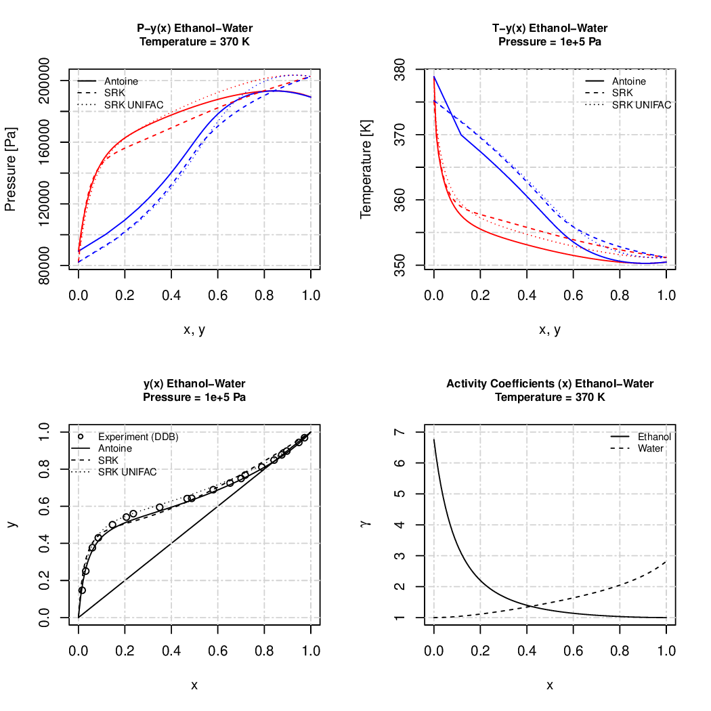

# vlecalc
vapor liquid equilibrium calculations

This functions are part of a master thesis for blending multicomponent mixtures and simulate whose distillation curves.

The code is written in R script interpreter language for stastical mathematics.
https://cran.r-project.org/

Bubble- and dewpoint calculations using Antoine and cubic equations with UNIFAC to fetch real mixture behavior.

All values are SI values (pressure [Pa], temperature [K]).

Examples

1. UNIFAC

UNIFAC.gen(Substances=c('ethanol','water'), verbose=T) # returns surface (unu) and interaction parameter (aij) matrizes

UNIFAC(Fractions=c(0.4,0.6), unu=unu, aij=aij, Temperature=300) # returns activity coefficients

2. Distillation curves

cs.boilingline(substances=c('ethanol', 'water'), fractions=c(0.4,0.6), pressure=1e+5, verbose=T) # returns

distillation curves for a closed system scenario, using two models

os.boilingline(substances=c('ethanol', 'water'), fractions=c(0.4,0.6), pressure=1e+5, verbose=T) # returns 

distillation curves for a open system scenario, using five models

3. Cubic Soave Redlich Kwong

3.1 Bubblepoint Temperature

SRK(temperature = 300, x=c(0.4,0.6), Tc=c(647.3, 562.0), Pc=c(221.20, 48.98), Ac=c(0.344,0.211), method = 'bubbleP')

Returns the bubblepoint pressure, gas fractions, fugacity coefficients and the departure functions of the enthalpy 
and entropy for the binary water-benzene mixture.

